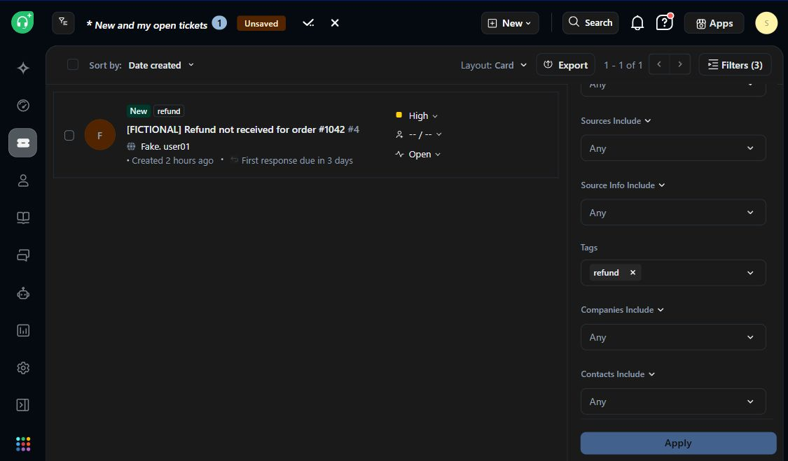
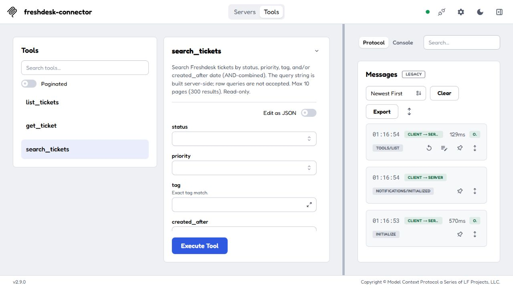
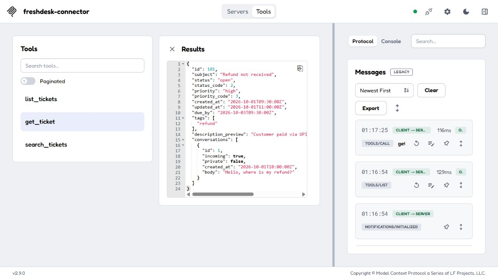

# Freshdesk connector

This read-only MCP server gives an agent three Freshdesk ticket tools: `list_tickets`, `get_ticket`, and `search_tickets`. It uses a Freshdesk API key, handles pagination and rate limits, and returns selected ticket fields. The connector's HTTP client sends only GET requests.

## Screenshots

The Freshdesk view shows a fictional ticket in a trial account, filtered by its `refund` tag. It shows the source record; the MCP screenshots below use the local mock and do not claim a live connector run.



MCP Inspector connected to this Node server and listing its three tools:



`get_ticket` returning fictional ticket 101 through the MCP server and local mock:



## Set up

You need Node.js 18 or newer, a Freshdesk account with API access, its subdomain, and an API key with permission to read tickets. In Freshdesk, open your profile settings and select **View API Key** to find the key.

```bash
cd freshdesk-connector
npm install
cp .env.example .env
```

On Windows, use `copy .env.example .env`. Add `FRESHDESK_DOMAIN` and `FRESHDESK_API_KEY` to `.env`. For `https://acme.freshdesk.com`, the domain value is `acme`. The server reports a missing variable by name without printing its value. Git ignores `.env`; do not submit it.

| Variable | Required | Default | Purpose |
| --- | --- | --- | --- |
| `FRESHDESK_DOMAIN` | Yes | None | Freshdesk subdomain |
| `FRESHDESK_API_KEY` | Yes | None | API key |
| `FRESHDESK_BASE_URL` | No | `https://{domain}.freshdesk.com/api/v2` | Local mock override |
| `REQUEST_TIMEOUT_MS` | No | `10000` | Timeout per HTTP request |
| `MAX_RETRIES` | No | `4` | Additional attempts after a retryable failure |

## Run and test

```bash
npm test                 # Local mock only; no Freshdesk credentials needed
npm start                # Start the MCP server over stdio
npm run demo -- --mock   # Show list, search, get, and a 429 retry locally
npm run demo             # Run the read-only demo against your Freshdesk account
npm run seed             # Optional: create 12 fictional tickets in your trial account
npm run tools:sync       # Regenerate tools.json from src/tools.js
```

`npm run seed` is the only script that writes to Freshdesk. It is separate from the MCP server and is optional. The server and demo read tickets.

To inspect the MCP tools with fictional data and no Freshdesk credentials, run `npx @modelcontextprotocol/inspector node scripts/inspector-mock.js`. The helper starts a local mock and points the same MCP server at it. To inspect a live account instead, run `npx @modelcontextprotocol/inspector node src/server.js` with `.env` configured.

## Connect an agent

Register the stdio server with an MCP client. Set the path to this checkout and supply the key through the client's secret store.

```json
{
  "mcpServers": {
    "freshdesk-connector": {
      "command": "node",
      "args": ["C:/path/to/freshdesk-connector/src/server.js"],
      "env": {
        "FRESHDESK_DOMAIN": "acme",
        "FRESHDESK_API_KEY": "<secret-store reference>"
      }
    }
  }
}
```

This is a generic MCP client example. Agent Studio needs an MCP connection that can launch a stdio server or an equivalent deployment adapter; this repository does not include an Agent Studio-specific adapter. Server diagnostics go to stderr so stdout stays available for MCP messages.

```text
Agent -> MCP server (src/server.js) -> ticket tools (src/tools.js)
      -> GET-only client (src/freshdeskClient.js) -> Freshdesk API v2
```

See [the tool specification](docs/TOOL_SPEC.md) for inputs and outputs and [the capabilities document](CAPABILITIES.md) for access limits.

## API behavior and design

The implementation follows the [Freshdesk API documentation](https://developers.freshdesk.com/api/). The project notes also record spot checks against a trial account for the `include` behavior below. A complete live demo of this Node.js connector is still outstanding.

- The API base URL is `https://{domain}.freshdesk.com/api/v2`. Authentication uses HTTP Basic with the API key as the username and `X` as the password.
- `GET /tickets` accepts `page` and `per_page` up to 100, with a 300-page API limit. The client requests `include=description`. By default, Freshdesk lists tickets created within the last 30 days; this connector does not expose `updated_since` for older tickets. `list_tickets` filters status and priority *after* fetching one page, so a filtered page can be short or empty while `has_more` is true. Use `search_tickets` for server-side filtering.
- `GET /tickets/{id}` fetches one ticket. The client requests `include=conversations` and falls back to `GET /tickets/{id}/conversations` if needed. The project notes say a trial account rejected the combined value `include=conversations,description`, while the ticket response already included its description.
- `GET /search/tickets` accepts the connector's validated query. Date comparisons use Freshdesk's `created_at:>'YYYY-MM-DD'` syntax. Freshdesk search returns at most 30 results per page and 10 pages. The connector reports `has_more` from the response total, within that limit. Search updates may take a few minutes to appear in Freshdesk's index.
- Freshdesk ticket status codes 2, 3, 4, and 5 map to open, pending, resolved, and closed. Priority codes 1 through 4 map to low, medium, high, and urgent.
- A 429 response triggers a retry after `Retry-After` seconds, capped at 60 seconds per wait. Without that header, the client uses exponential backoff. It also retries 502, 503, 504, and network errors. It does not retry 401, 403, or 404.

The client hard-codes GET, and a test checks the methods received by the mock server. Tool responses select ticket fields and omit requester contact fields. Email and phone masking in description and conversation text is pattern-based; it does not guarantee removal of all personal data. The mock server makes retry and timeout tests repeatable without a Freshdesk account.

## Errors

Tools return short messages without stack traces.

| Code | Cause | Agent-facing result |
| --- | --- | --- |
| `AUTH_FAILED` | HTTP 401 or 403 | Check the API key, domain, and ticket permissions. |
| `NOT_FOUND` | HTTP 404 | Ticket not found. |
| `RATE_LIMITED` | 429 after all retries | Retry after the reported number of seconds. |
| `TIMEOUT` | Request exceeds `REQUEST_TIMEOUT_MS` | Try again shortly. |
| `INVALID_INPUT` | Invalid ticket ID, page, or filter | Correct the reported input. |
| `UPSTREAM_ERROR` | Other HTTP error or exhausted retries | Try again shortly. |

## Assumptions and limits

One server instance connects to one Freshdesk account. The key must have ticket read access. The account's API allowance is shared with its other API consumers. Plan-specific access and rate limits need checking against the account used for deployment.

This connector cannot create or change tickets, read attachments or contact records, or run keyword search. The list tool does not expose older tickets by default. Search is limited to 300 results per query; `get_ticket` returns at most five conversation entries. There is no cache, webhook listener, or per-agent audit log. See [CAPABILITIES.md](CAPABILITIES.md) for the full list.

Local mock tests cover the client and tool handlers. This checkout has no recorded end-to-end Agent Studio run or full live Freshdesk demo of the Node.js connector. Run `npm run demo` and an MCP client session with a trial account before claiming those checks in a submission.
